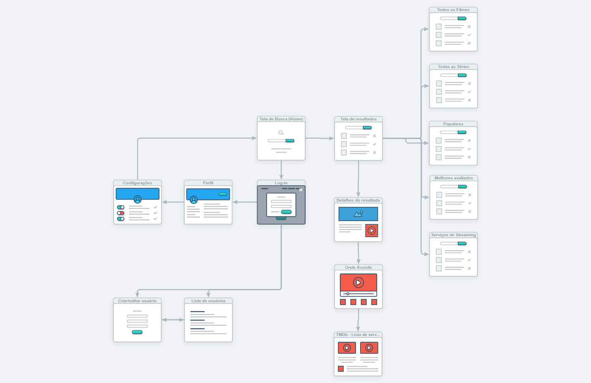
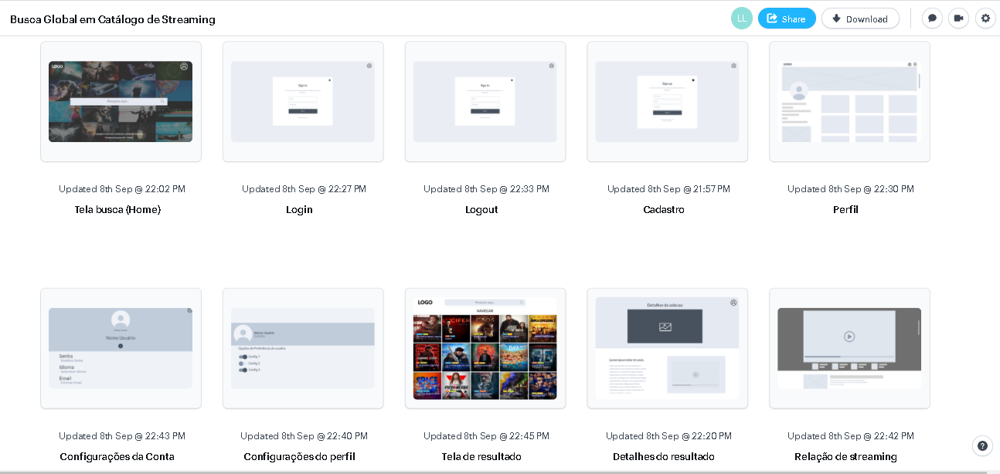

# Projeto de Interface

Visão geral da interação do usuário pelas telas do sistema e protótipo interativo das telas com as funcionalidades que fazem parte do sistema (wireframes).

## User Flow

Fluxo de usuário definido para a utilização de cliques na interface do Catálogo de Streamer.

## Wireframes

São protótipos usados em design de interface para sugerir a estrutura de um site web e seu relacionamentos entre suas páginas. Um wireframe web é uma ilustração semelhante do layout de elementos fundamentais na interface.

> - [Link de acesso ao wireframes (protótipo interativo) desenvolvido na ferramente web Marvel App](https://marvelapp.com/prototype/h2f92a7)
 
