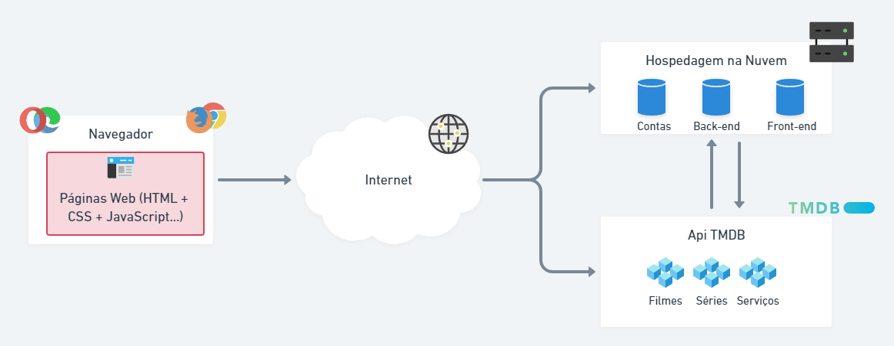
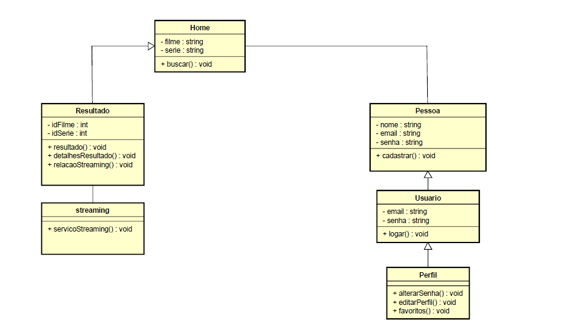
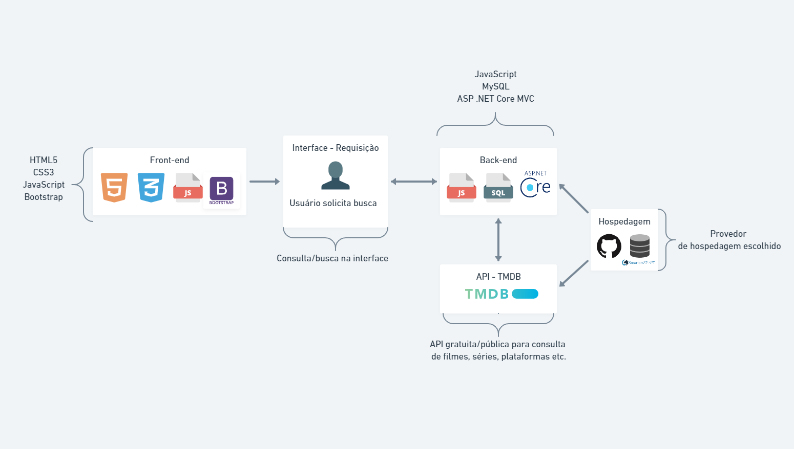

# Arquitetura da Solução

## Diagrama de componentes

Os componentes que fazem parte da solução, inicialmente, são apresentados na Figura abaixo.

Figura - Arquitetura da Solução

A solução implementada conta, inicialmente, com os seguintes módulos:
- **Navegador** - Interface básica, usada para acessar a aplicação
  - **Páginas Web** - Conjunto de arquivos HTML, CSS, JavaScript e imagens que implementam as funcionalidades do sistema.
  
 - **API TMDB** - API pública, gratuita e extremamente poderosa que traz o acervo do conteúdo que será apresentado no site
   - **Filmes** - filmes trazidos pela API
   - **Séries** - séries de TV ou de serviços de streaming trazidos pela API
   - **Serviços** - serviços de streaming online trazidos pela API

 - **Hospedagem na Nuvem** - local na internet onde fica armazenada a estrutura da nossa aplicação, bem como as contas de usuário
   - **Contas** - contas dos usuários que se cadastram no site, armazenando as preferências, log-in, senha, e-mail
   - **Back-end** - os "bastidores" da aplicação, que envolve camadas de segurança, comunicação com a API, com o Banco de Dados
   - **Front-end** - parte visual e interagível da aplicação. Interface.

A imagem acima ilustra a o fluxo do usuário em nossa solução. Abaixo, iremos descrever o fluxo detalhadamente. Entenda "Ele" como o usuário da aplicação.

Ao entrar na aplicação, ele está na Tela de Busca [Home]. Ele pode optar por fazer login, o que faz ir para a tela Login que, caso ele não tenha login, poderá acessar a tela de Cadastro. 

Após o Login, ele é redirecionado de volta para a Tela de Busca [Home]. Ele pode fazer uma busca, que o levaria para a Tela de Resultado, ou pode acessar seu perfil personalizado, que o leva para a página Perfil, que ele pode vê suas informações pessoais e públicas definidas. Da página Perfil, ele pode fazer o Logout, que o levaria de volta para a página Tela de Busca [Home] sem uma sessão iniciada, ou ele poderia acessar a Configuração da Conta, para definir configurações como E-mail e Senha. A partir do Perfil, ele pode acessar também as Configurações do Perfil, para definir preferências menos técnicas, como o que gosta de assistir, consultar suas listas, favoritos etc. Daí, ele pode ir também para a tela Detalhes do Resultado.

Da Tela de Resultado, ele deve escolher algo do retorno da pesquisa, o que o levaria para a página de Detalhes do Resultado. Da página Detalhes do Resultado, ele pode consultar a Relação de Streaming, que mostra em quais serviços/plataformas aquele conteúdo está disponível para assistir, alugando, comprando ou assinando. Caso ele escolha algum dos serviços/plataformas, ele é enviado diretamente para a tela externa, que é o serviço de Streaming em si.

Inicialmente, essa é a experiência desejada e planejada para o usuário da plataforma.

## Diagrama de Classes

## Tecnologias Utilizadas

Tecnologias utilizadas:

  **Front-end:**
  - **HTML5** 
  - **CSS3** 
  - **JavaScript** 
  - **Bootstrap** 

  **Back-end:**

  - **JavaScript** 
  - **Mysql** 
  - **ASP .NET Core Model-View-Controller** 

  **Serviços Web:**
  - **REST API TMDB** 

## Hospedagem

No momento, estamos utilizando o GitHub Pages para hospedar nosso projeto e site. Escolhemos o GitHub Pages pela já prática integração com o GitHub e o repositório, facilitando assim a gestão dos diretórios e arquivos do site. 

Como Banco de Dados final, conforme sugeriu o professor, estamos utilizando o Smarter ASP, armazendo lá as contas/usuários e o que mais for necessário.

Uma página provisória do nosso projeto foi disponibilizado através do link: https://icei-puc-minas-pco-si.github.io/pco-si-2021-2-tec-web-busca-global-em-catalogos-de-streaming/
